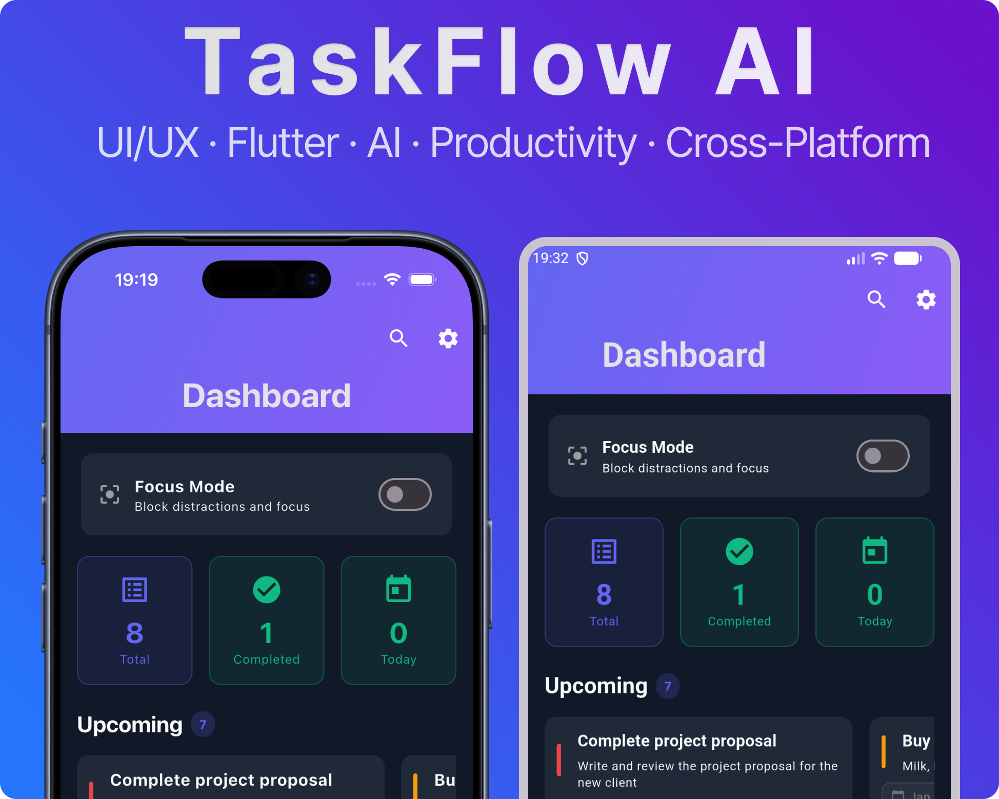

# TaskFlow AI

<div align="center">
  <h3>🚀 Intelligent Task Management App with AI Assistant</h3>
  <p>Beautiful, modern, and powerful task manager built with Flutter</p>
  
  
  
  
</div>

---

## ✨ Features

### 🎯 Core Functionality
- **📋 Task Management**: Full CRUD operations with subtasks, tags, and priorities
- **🎯 Smart Prioritization**: AI-powered automatic task prioritization
- **📅 Calendar Integration**: Visual calendar view with task scheduling
- **📊 Analytics Dashboard**: Beautiful charts and productivity statistics
- **🤖 AI Assistant**: Interactive chat interface for task management queries
- **🔍 Advanced Search & Filter**: Find tasks by status, priority, category, and date range

### 🎨 User Experience
- **Modern UI**: Beautiful Material Design 3 with smooth animations
- **🌓 Dark/Light Theme**: Support for system theme with 3 customizable color schemes
- **🌍 Multi-language**: Support for English, Russian, and Spanish
- **📱 Cross-platform**: Works seamlessly on iOS, Android, Web, and Desktop
- **🎤 Voice Control**: Create tasks using voice commands with speech-to-text
- **💬 Collaboration**: Add comments to tasks for team communication

### 📤 Data Management
- **Export/Import**: Export tasks to CSV, JSON, and PDF formats
- **🏷️ Smart Tags**: Automatic tag generation based on task content using NLP
- **💾 Local Storage**: Offline-first with Hive for data persistence
- **☁️ Cloud Sync**: Firebase integration for cloud synchronization (optional)

### 🔐 Authentication
- Email/Password authentication with Firebase
- User registration and profile management
- Demo mode with pre-loaded sample tasks
- Persistent sessions

---

## 📸 Screenshots



<div align="center">
  <p><em>TaskFlow AI - Screenshots of the application</em></p>
</div>

---

## 🏗️ Architecture

This project follows **Clean Architecture** principles with clear separation of concerns:

```
lib/
├── core/                    # Core functionality
│   ├── constants/          # App-wide constants
│   ├── errors/             # Error handling
│   ├── localization/       # Localization support
│   ├── theme/              # App themes & color schemes
│   ├── utils/              # Utility functions
│   └── widgets/            # Reusable widgets
│
├── features/               # Feature modules
│   ├── auth/              # Authentication
│   │   ├── data/
│   │   ├── domain/
│   │   └── presentation/
│   ├── tasks/             # Task management
│   ├── calendar/          # Calendar view
│   ├── analytics/         # Analytics & statistics
│   ├── ai_assistant/      # AI assistant chat
│   ├── settings/          # App settings
│   ├── dashboard/         # Dashboard overview
│   └── main/              # Main navigation
│
├── injection.dart         # Dependency injection setup
└── main.dart             # Application entry point
```

### State Management

- **BLoC/Cubit Pattern**: Used for managing application state
- **Repository Pattern**: Abstracts data sources (local/remote)

---

## 🚀 Getting Started

### Prerequisites

- Flutter SDK 3.10.4 or higher
- Dart SDK 3.10.4 or higher
- Xcode (for iOS development)
- Android Studio (for Android development)

### Installation

1. **Clone the repository:**
   ```bash
   git clone https://github.com/rafaelwww07-ios/TaskFlowAI.git
   cd TaskFlowAI
   ```

2. **Install dependencies:**
   ```bash
   flutter pub get
   ```

3. **Set up iOS dependencies (if developing for iOS):**
   ```bash
   cd ios
   pod install
   cd ..
   ```

4. **Run the app:**
   ```bash
   # For all platforms
   flutter run
   
   # For specific platform
   flutter run -d ios        # iOS
   flutter run -d android    # Android
   flutter run -d chrome     # Web
   ```

### Firebase Setup (Optional)

1. Create a Firebase project at [Firebase Console](https://console.firebase.google.com/)
2. Add iOS and Android apps to your Firebase project
3. Download `google-services.json` (Android) and `GoogleService-Info.plist` (iOS)
4. Place them in the appropriate directories:
   - Android: `android/app/google-services.json`
   - iOS: `ios/Runner/GoogleService-Info.plist`

---

## 🛠️ Key Technologies

### State Management & Architecture
- **flutter_bloc**: Reactive state management
- **get_it**: Dependency injection
- **equatable**: Value equality comparisons

### UI & Design
- **flutter_animate**: Smooth animations
- **confetti**: Celebration animations
- **shimmer**: Loading placeholders
- **table_calendar**: Calendar widget
- **fl_chart**: Beautiful charts

### Storage & Data
- **hive**: Fast local database
- **shared_preferences**: Simple key-value storage
- **firebase_core**: Firebase integration
- **cloud_firestore**: Cloud database

### Features
- **speech_to_text**: Voice input
- **geolocator**: Location services
- **flutter_local_notifications**: Push notifications
- **file_picker**: File selection
- **share_plus**: Share functionality
- **pdf**: PDF generation
- **csv**: CSV parsing

---

## 📖 Usage

### Creating Tasks

1. **Manual Creation**: Tap the `+` button and fill in task details
2. **Voice Input**: Tap the microphone icon to create tasks with voice commands
3. **Quick Add**: Use the quick add dialog from the dashboard

### Managing Tasks

- **Filter**: Use the filter icon to filter by status, priority, or category
- **Search**: Use the search bar to find specific tasks
- **Calendar**: View tasks in calendar format with drag-and-drop
- **Analytics**: Track your productivity with detailed statistics

### Settings

- **Theme**: Switch between light/dark mode
- **Language**: Choose from English, Russian, or Spanish
- **Color Scheme**: Select from 3 predefined color schemes
- **Notifications**: Configure reminder preferences

---

## 🧪 Testing

Run tests with:
```bash
flutter test
```

---

## 📱 Platform Support

- ✅ iOS 13.0+
- ✅ Android 5.0+ (API 21+)
- ✅ Web
- ✅ macOS
- ✅ Linux
- ✅ Windows

---

## 🌍 Localization

The app supports multiple languages:
- 🇺🇸 English
- 🇷🇺 Russian
- 🇪🇸 Spanish

---

## 🤝 Contributing

Contributions are welcome! Please feel free to submit a Pull Request.

1. Fork the repository
2. Create your feature branch (`git checkout -b feature/AmazingFeature`)
3. Commit your changes (`git commit -m 'Add some AmazingFeature'`)
4. Push to the branch (`git push origin feature/AmazingFeature`)
5. Open a Pull Request

---

## 📄 License

This project is licensed under the MIT License - see the [LICENSE](LICENSE) file for details.

---

## 🙏 Acknowledgments

- Flutter team for the amazing framework
- All contributors and open-source libraries used
- Material Design 3 for design inspiration

---

## 📧 Contact

For questions or support, please open an issue on GitHub.

---

<div align="center">
  <p>Made with ❤️ using Flutter</p>
  <p>⭐ Star this repo if you find it helpful!</p>
</div>
